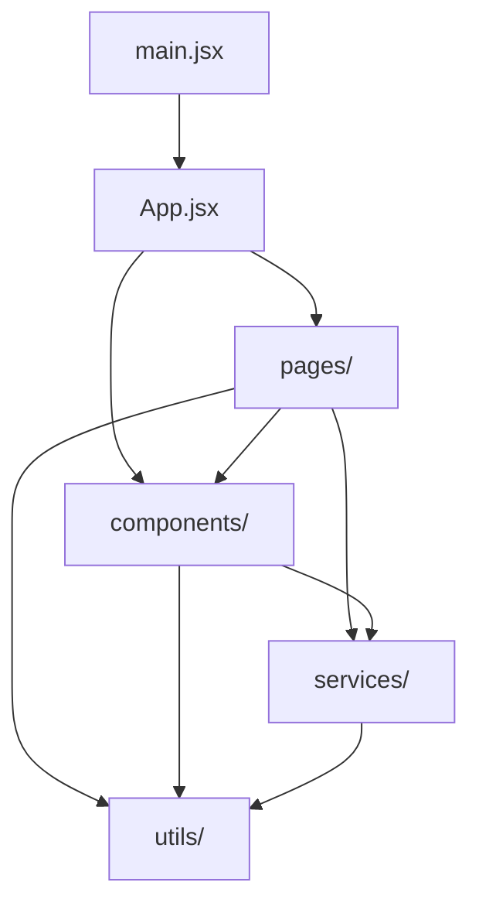
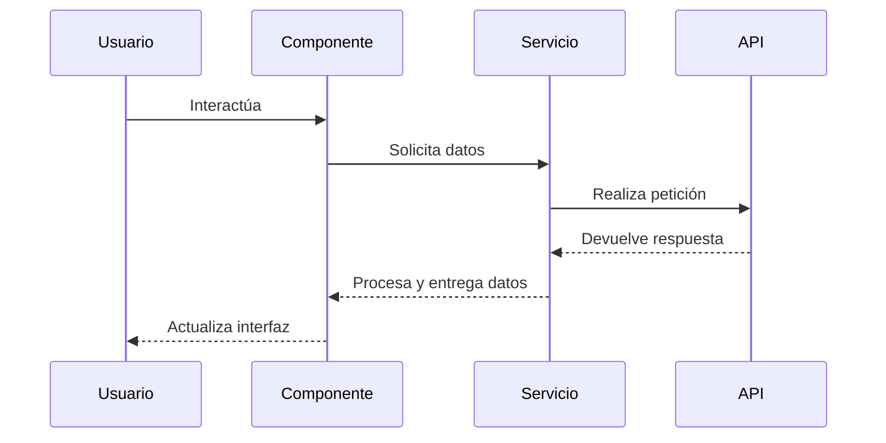

#  Instala librerias
   npm install 
# Iniciar el servidor de desarrollo:
   npm run dev

# URL Web
http://localhost:5173/

# ################################################

# acdata_platform_web

## Descripción General del Proyecto

Este proyecto es una aplicación web desarrollada con React y Vite, diseñada para [propósito principal del proyecto, por ejemplo: "gestionar y visualizar datos de análisis de crédito"]. La plataforma ofrece una interfaz de usuario intuitiva y eficiente para [principales usuarios, por ejemplo: "analistas financieros y gestores de riesgo"].

### Funcionalidades Principales

- [Funcionalidad 1, por ejemplo: "Importación y procesamiento de datos crediticios"]
- [Funcionalidad 2, por ejemplo: "Análisis predictivo de riesgo crediticio"]
- [Funcionalidad 3, por ejemplo: "Generación de reportes personalizados"]
- [Funcionalidad 4, por ejemplo: "Gestión de perfiles de usuario y autenticación"]

## Estructura del Proyecto

El proyecto sigue una estructura típica de una aplicación React con Vite:

```
acdata_platform_web/
│
├── public/                 # Archivos públicos estáticos
│   └── index.html          # Punto de entrada HTML
│
├── src/                    # Código fuente de la aplicación
│   ├── context/                # Contexto de la aplicación para autenticación y configuración global
│   │   └── AuthContext.tsx     # Contexto para manejo de autenticación
│   ├── components/         # Componentes React reutilizables
│   ├── pages/              # Componentes de página
│   ├── services/           # Servicios para lógica de negocio y API
│   ├── utils/              # Utilidades y funciones auxiliares
│   ├── styles/             # Estilos globales y variables
│   ├── App.jsx             # Componente principal de la aplicación
│   └── main.jsx            # Punto de entrada de React
│   ├── utils/                  # Funciones auxiliares y utilidades
│   │   ├── logger.ts           # Configuración de la librería de logs
│   │   └── constants.ts        # Constantes globales
│
├── tests/                  # Pruebas unitarias y de integración
│
├── vite.config.js          # Configuración de Vite
├── package.json            # Dependencias y scripts del proyecto
└── README.md               # Este archivo
```

### Interrelación de Componentes

Los componentes en `src/components/`  --> son utilizados por las páginas --> 
en `src/pages/`. Los servicios en `src/services/` manejan la lógica de negocio y las llamadas a API, siendo utilizados tanto por componentes como por páginas. Las utilidades en `src/utils/` proporcionan funciones auxiliares utilizadas en toda la aplicación.

## Project Structure

- `src/services/apiService.ts`: Module to handle API requests.
- `src/services/syncService.ts`: Service to handle user synchronization.
- `src/components/modules/cpanel/ControlPanel.tsx`: Main component for the Control Panel.

## Diagramas

### Diagrama de Relaciones



### Diagrama de Secuencia



## Instrucciones de Despliegue

### Despliegue Local

1. Clonar el repositorio:
   ```
   git clone https://github.com/datacons-inhub/acdata_platform_web.git
   cd acdata_platform_web
   ```

2. Instalar dependencias:
   ```
   npm install
   ```

3. Iniciar el servidor de desarrollo:
   ```
   npm run dev
   ```

4. Acceder a la aplicación en `http://localhost:5173`

### Despliegue en Producción

#### Usando Docker

1. Construir la imagen Docker:
   ```
   docker build -t acdata_platform_web .
   ```

2. Ejecutar el contenedor:
   ```
   docker run -p 8080:80 acdata_platform_web
   ```

3. Acceder a la aplicación en `http://localhost:8080`

#### Despliegue en AWS S3

1. Construir la aplicación:
   ```
   npm run build
   ```

2. Configurar AWS CLI con tus credenciales.

3. Subir los archivos a S3:
   ```
   aws s3 sync dist/ s3://nombre-de-tu-bucket --delete
   ```

4. Configurar el bucket para alojamiento de sitio web estático en la consola de AWS.

#### Despliegue en Host Server

1. Construir la aplicación:
   ```
   npm run build
   ```

2. Transferir los archivos de la carpeta `dist/` a tu servidor web.

3. Configurar el servidor web (por ejemplo, Nginx) para servir los archivos estáticos y manejar el enrutamiento de la aplicación de una sola página (SPA).

Recuerda ajustar las configuraciones de seguridad, CORS, y variables de entorno según sea necesario para tu entorno de producción específico.